# Vault Commander Diagrams

> Mermaid diagrams for visual reference. Renders in GitHub, Obsidian, and most markdown viewers.

## System Context

```mermaid
flowchart TB
    subgraph User["👤 User Intent"]
        intent[What I want to do]
    end
    
    subgraph Raycast["⌨️ Raycast Interface"]
        subgraph VC["Vault Commander"]
            capture[capture]
            today[today]
            add[add]
            search[search]
        end
    end
    
    subgraph Systems["Backend Systems"]
        obsidian[(Obsidian<br/>Memory/PKM)]
        claude[Claude<br/>Brain/AI]
        todoist[(Todoist<br/>Tasks)]
    end
    
    intent --> VC
    capture --> obsidian
    today --> obsidian
    add --> obsidian
    search --> obsidian
    
    claude -.->|v0.2| obsidian
    todoist -.->|v0.3| obsidian
```

## Module Dependencies

## Data Flow: Capture

```mermaid
sequenceDiagram
    participant U as User
    participant R as Raycast
    participant C as capture.tsx
    participant V as vault.ts
    participant F as File System
    
    U->>R: ⌘+Space "vault capture"
    R->>C: Open form
    U->>C: Type thought + Submit
    C->>V: generateCaptureFilename()
    V-->>C: capture-2026-01-07-143521.md
    C->>V: writeFile(path, content)
    V->>F: Create Inbox/capture-*.md
    F-->>V: ✓
    V-->>C: ✓
    C->>R: showHUD("Captured to Inbox")
    R->>U: Close, back to context
```

## Data Flow: Today

```mermaid
sequenceDiagram
    participant U as User
    participant R as Raycast
    participant T as today.tsx
    participant D as daily.ts
    participant V as vault.ts
    participant O as Obsidian
    
    U->>R: ⌘+Space "vault today"
    R->>T: Execute command
    T->>D: getDailyNotePath(today)
    D-->>T: Journal/Daily/2026-01-07-Wed.md
    T->>D: dailyNoteExists(path)
    
    alt Note exists
        D-->>T: true
    else Note missing
        D-->>T: false
        T->>D: createDailyNote(path)
        D->>V: writeFile(path, template)
        V-->>D: ✓
    end
    
    T->>V: openInObsidian(vault, path)
    V->>O: obsidian://open?vault=...
    O-->>U: Daily note opens
```

## Data Flow: Add

```mermaid
sequenceDiagram
    participant U as User
    participant R as Raycast
    participant A as add.tsx
    participant D as daily.ts
    participant V as vault.ts
    participant F as File System
    
    U->>R: ⌘+Space "vault add"
    R->>A: Open form
    U->>A: Select section + Type content
    A->>D: ensureDailyNote(today)
    D-->>A: path (created if needed)
    A->>V: appendToSection(path, section, content)
    V->>F: Read file
    F-->>V: Content
    V->>V: Find "## Section"
    V->>V: Insert below header
    V->>F: Write updated file
    F-->>V: ✓
    V-->>A: ✓
    A->>R: showHUD("Added to Tasks")
    R->>U: Close
```

## Data Flow: Search

```mermaid
sequenceDiagram
    participant U as User
    participant R as Raycast
    participant S as search.tsx
    participant I as search.ts
    participant F as File System
    participant O as Obsidian
    
    U->>R: ⌘+Space "vault search"
    R->>S: Open list view
    S->>I: buildSearchIndex(vaultPath)
    I->>F: Glob all .md files
    F-->>I: File list
    I->>F: Read first 500 chars each
    F-->>I: Content previews
    I-->>S: SearchIndex
    
    U->>S: Type query
    S->>I: searchVault(index, query)
    I->>I: fuse.js fuzzy match
    I-->>S: SearchResult[]
    S->>U: Display results + preview
    
    U->>S: Select result
    S->>O: obsidian://open?vault=...
    O-->>U: Note opens
```

## Phase Roadmap

## Config Evolution

